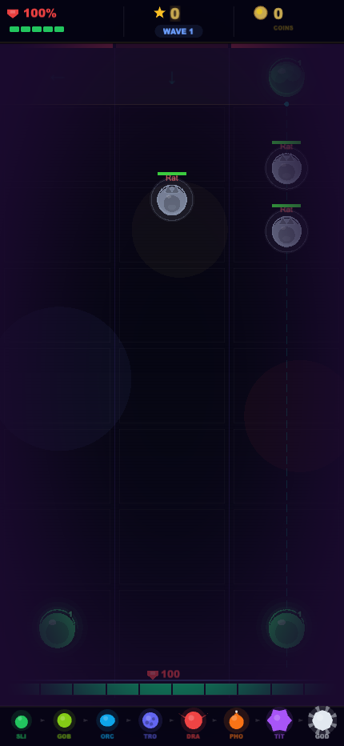

# Merge Chaos

A mobile-first HTML5 game combining **Tower Defense** and **Merge mechanics**. Drop creatures into columns, they shoot enemies — merge two identical creatures to evolve them into something stronger. Defend your base.

Built with Phaser 3.60. Runs in the browser and on Android via Capacitor.

---

## Screenshots

<div align="center">
  
  
  
</div>

---

## Gameplay

- **Drop** creatures into one of 3 columns
- **Merge** two identical creatures side-by-side → evolve to the next tier
- **8 creature tiers**: Slime → Goblin → Orc → Troll → Dragon → Phoenix → Titan → God
- **4 enemy types**: Rat, Zombie, Demon, Boss
- **Shop system** between waves: Power Surge, Repair Base, Slow Wave, Armor Up
- Waves get harder — survive as long as you can

---

## Stack

| | |
|---|---|
| Game engine | [Phaser 3.60](https://phaser.io) |
| Mobile wrapper | [Capacitor](https://capacitorjs.com) |
| Trailer | [Remotion](https://remotion.dev) |
| Deploy | Netlify |
| Language | Vanilla JavaScript |

---

## Run Locally

```bash
git clone https://github.com/maxqnx/merge-chaos.git
cd merge-chaos
python3 server.py
# open http://localhost:3000
```

> `server.py` is required (not `python3 -m http.server`) — it writes an audit log used for debugging.

---

## Android

The `android/` folder contains a Capacitor project. To build the APK:

```bash
npm install
npx cap sync android
npx cap open android
# Build → Generate Signed APK in Android Studio
```

Pre-built debug APKs are in `builds/`.

---

## Project Structure

```
merge-chaos/
├── index.html              # Entry point
├── js/
│   ├── config.js           # Creatures, enemies, game config, shop items
│   ├── main.js             # Phaser init (430×932px)
│   └── scenes/
│       ├── BootScene.js    # Start screen — dark void aesthetic
│       ├── GameScene.js    # All game logic
│       └── UIScene.js      # HUD, death screen
├── android/                # Capacitor Android project
├── builds/                 # Pre-built APKs
├── trailer/                # Remotion trailer (TikTok + YouTube formats)
└── www/                    # Capacitor web build output
```

---

## Creature Tiers

| Level | Name | Damage | HP |
|---|---|---|---|
| 1 | Slime | 2 | 5 |
| 2 | Goblin | 3 | 10 |
| 3 | Orc | 6 | 20 |
| 4 | Troll | 12 | 40 |
| 5 | Dragon | 24 | 80 |
| 6 | Phoenix | 48 | 160 |
| 7 | Titan | 96 | 320 |
| 8 | God | 192 | 640 |
